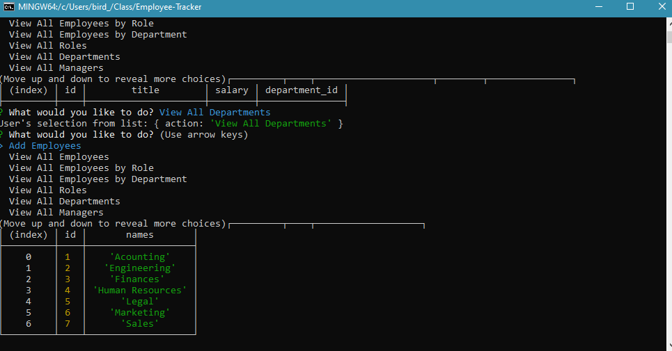

# Employee-Tracker



>Employee Tracker system

---

### Table of Contents

* [Description](#description)
* [How To Use](#how-to-use)
* [References](#references)
* [License](#license)
* [Author Info](#author-info)

---

## Description
This app is for the owner of a business that wants an easy way to view and manage the departments, roles, and employees within his/her company


#### Technologies

- node
- MYSQL

---

## How To Use

#### Installation


#### API Reference


```NODE
    NPM install
    NPM employees.js

```
[Back To The Top](#Employee-Tracker)

---

## References

- YouTube  - [YouTube](https://drive.google.com/file/d/1hug0ShTEMKFTCPo1VJsOuEX1aBTY09oN/view)

[Back To The Top](#Employee-Tracker)

---

## License

Copyright(c) [2020] [Erin K Fisher]

[Back To The Top](#Employee-Tracker)

---

## Author Info

- GitHub - [FisherE20](https://github.com/FisherE20)
- Website - [FisherE20](https://fishere20.github.io/Responsive-Portfolio/) 

[Back To The Top](#Employee-Tracker)